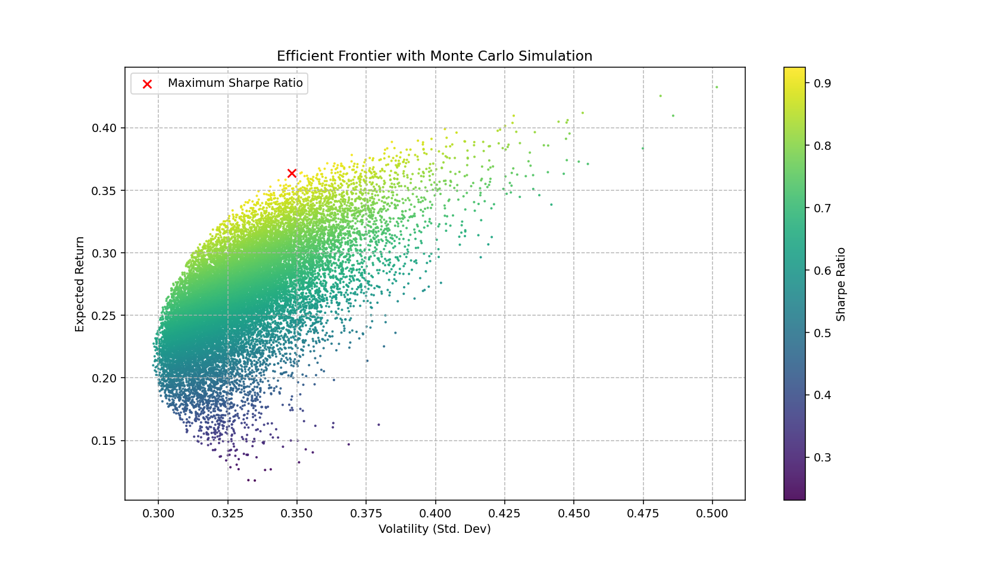
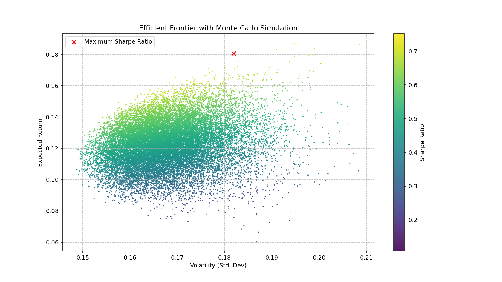
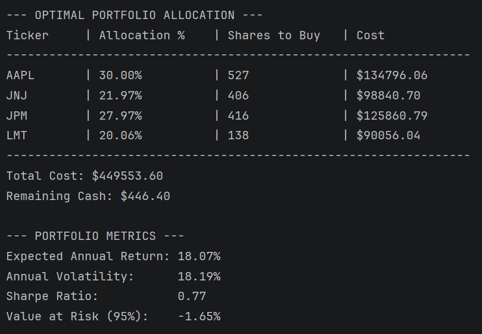
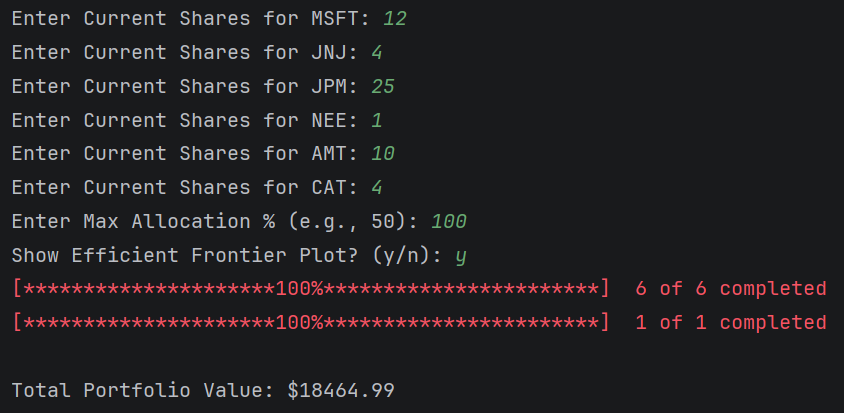
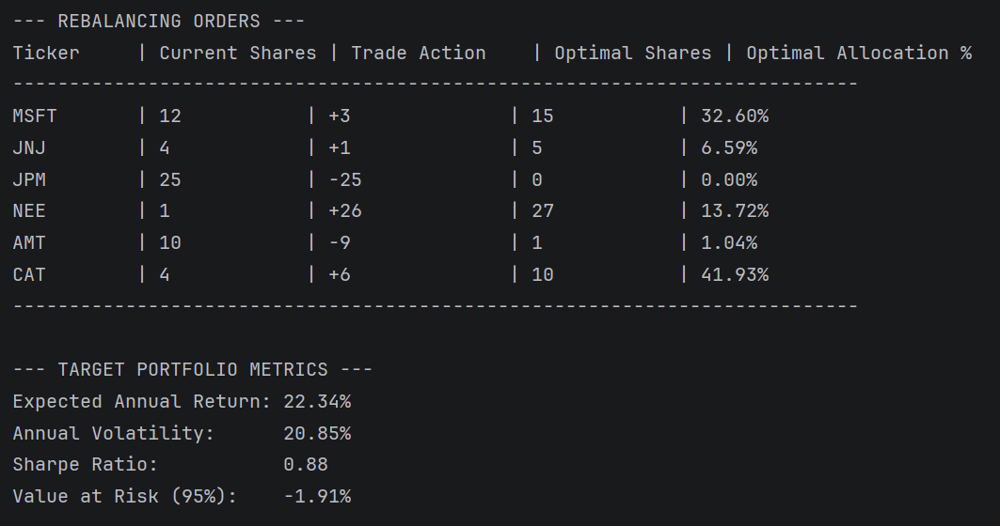
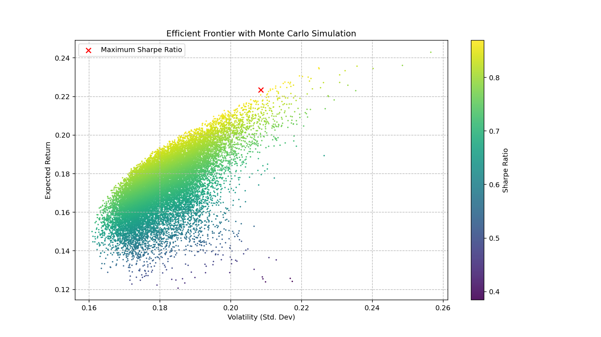

# Portfolio Optimization Toolkit

## Overview
A Python-based financial modeling tool that constructs optimal portfolios using **Mean-Variance Optimization (MVO)**. It uses Monte Carlo simulations (plotted) to analyze risk/return trade-offs and calculates **Value at Risk (VaR)** to quantify downside potential.

## Installation
1. Clone this repo.
2. Run `pip install -r requirements.txt` to install the necessary libraries
3. Run main.py and follow the CLI prompts.

## Features
* **Data & Storage**: Scrapes financial data, stores it in SQL database.
* **Mathematical Optimization**: Uses optimization to maximize Sharpe Ratio.
* **Risk Analysis**: Calculates 95% Historical VaR and Volatility.
* **Monte Carlo Simulation**: Generates 20,000 random portfolios to visualize the Efficient Frontier in matplotlib.
* **Portfolio Rebalancing**: Calculates necessary trades (buy/sell) to transform current portfolio into the optimal portfolio.
* **Interactive CLI**: Rebalancing tool to calculate necessary trades (buy/sell) to transform current portfolio into the optimal portfolio.

### To Do:
* More models (CAPM, Black-Litterman, risk parity)
  * Additional asset types (derivatives, fixed income)
* Improve UI
* Additional constraints
* Market signals

### Libraries used
* **Python:** Pandas, NumPy, SciPy, Matplotlib, Logging, and more (in [requirements.txt](requirements.txt)).
* **SQL:** SQLite for time-series data storage.

## Showcase
Some examples of portfolios and what the model outputs. Any number of stocks (2+) will work. These (and more) are portfolios that are included as presets (enter 'P' in the CLI) if you wish to use them as testcases.

### Portfolio A: Select Semiconductors (TSM, AVGO, AMD, QCOM, INTC)

Mean Variance Frontier (Optimal Portfolio as red X):

Output in Terminal (constraints: 60% max allocation, 100k budget):
<table>
  <tr>
    <td>
      
    </td>
  </tr>
</table>

### Portfolio B: Blue Chips (AAPL, JPM, JNJ, PG, XOM, LMT, DIS, T)

Mean Variance Frontier (Optimal Portfolio as red X):

Output in Terminal (constraints: 30% max allocation, 450k budget):
<table>
  <tr>
    <td>
      
    </td>
  </tr>
</table>

### Portfolio C, Rebalancing: Random Mix (MSFT, JNJ, JPM, NEE, AMT, CAT)
Here we take an existing portfolio, and plug in the share amounts. Next, the algorithm calculates the optimal weights, and then calculates the most efficient way to rebalance the portfolio to achieve those weights.

#### Input
<table>
  <tr>
    <td>
      
    </td>
  </tr>
</table>

#### Output
<table>
  <tr>
    <td>
      
    </td>
  </tr>
</table>

The Efficient Frontier for this mixed portfolio:

## Methodology

This model uses Modern Portfolio Theory (MPT) to construct efficient (optimal Sharpe) portfolios.

### 1. Metrics Calculation
For a portfolio with weight vector $w$ and asset expected returns vector $\mu$:

*   **Expected Return:** $E[R_p] = w^T \mu$
*   **Portfolio Variance:** $\sigma_p^2 = w^T \Sigma w$
    *   Where $\Sigma$ is the covariance matrix of asset returns.
*   **Sharpe Ratio:** $S_p = \frac{E[R_p] - R_f}{\sigma_p}$
    *   Where $R_f$ is the risk-free rate.

### 2. Optimization Problem
We maximize the Sharpe Ratio by minimizing its negative. The optimization problem is defined as:

$\underset{w}{\text{minimize}} \quad - \frac{w^T \mu - R_f}{\sqrt{w^T \Sigma w}}$

$\text{subject to:} \quad \sum_{i=1}^{n} w_i = 1, \quad 0 \le w_i \le w_{max}$

*   $w_{max}$ = maximum allocation constraint per asset.
*   We solve for $w_{i}$ using Sequential Least Squares Programming (SLSQP).

### 3. Value at Risk (VaR)
We calculate 95% Historical VaR is calculated by taking the 5th percentile of the portfolio's (p) historical return distribution:

$VaR_{95} = \text{percentile}(R_{p}, 5)$

### Caveats
* Model is based on 10-Year historical stock prices and Treasury yields. Stocks with short histories may not produce meaningful results.
* Covid-19 skews data heavily. Adjusting dates to 2021-2026 may produce "cleaner" results but is also less data the model has to work with.
* It's a simple model, at least so far. It won't make you rich, but it's fun to tweak the parameters and see how the plots / optimal weights change.

## Disclaimers
For educational purposes only. Not financial advice. 
MIT License, feel free to fork or do whatever you want with it.
